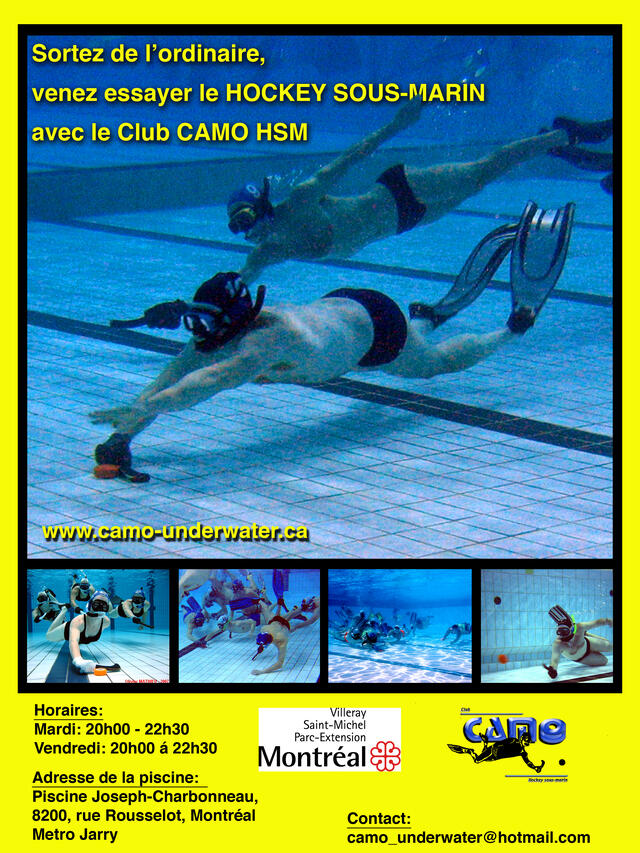
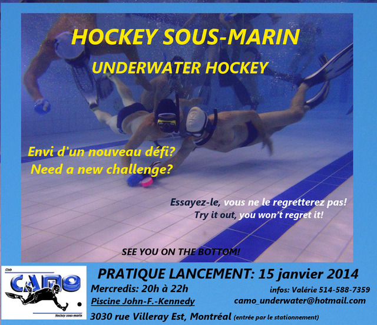
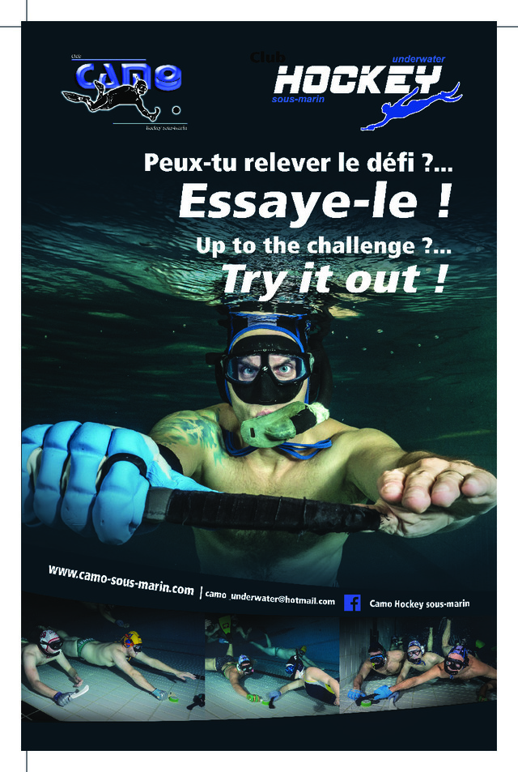
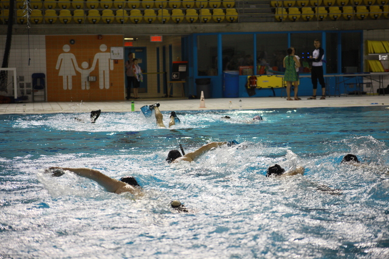
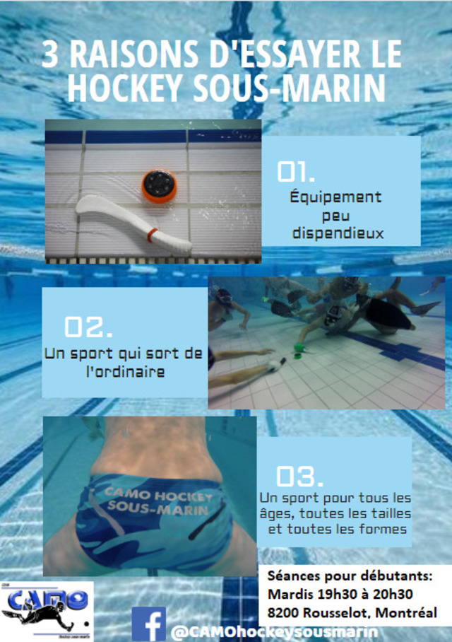

# History of CAMO Underwater Hockey

By Michel Langlois

Sources:

* Normand Lavallée
* François Rouisse
* Lionel Dumaux

## The Emergence of Underwater Hockey (1954)

We cannot discuss the history of the CAMO underwater hockey club without recounting the key moments in the emergence of the sport. Invented in 1954 in the south of England by Alan Blake, underwater hockey is associated with the image of the octopus's eight tentacles, representing a team of six players and two substitutes. The game, very rudimentary, simply consisted of pushing a brass puck with a small wooden stick. Thus, *Octopush* made its debut in sports history.

## Initial Expansion (From 1954)
The interest in playing hockey owes much to its physical nature, allowing diving and spearfishing enthusiasts to stay in shape. As early as 1954, enthusiasm for the sport quickly led to the organization of inter-club matches, competitions, championships, media coverage, and even tourism promotions. Hockey then expanded throughout the Commonwealth.

## American Influence and Neil's Style (1960s)
In 1960, six years later, under the influence of Bill Neil, the sport was reinvented in the United States in the Chicago area. Neil's style was very different from the English style. It was characterized by the use of a mini ice hockey stick held with two hands, and sometimes even a diving tank was worn. But the English style would eventually prevail in the United States, especially in the 1970s, under Canadian influence.

## Standardization and World Championships (1980-1984)
This period saw hesitation between the two styles. The successive World Championships (1980 - Vancouver, 1982 - Brisbane) gradually convinced players to switch to the short stick. 1984 definitively enshrined this practice with the publication of the official C.M.A.S. rules following the Chicago World Championships.

## Arrival in Canada (1962)
In Canada, the history of underwater hockey began in 1962 in Vancouver with Australian diving instructor Norm Liebeck. It was from this origin that hockey gradually migrated eastward across the country.

## Introduction in Quebec (1965 - Early 1970s)
In Quebec, hockey was introduced in 1965 under the influence of Rodrigue Sarrazin and Georges Bélanger. In the early 1970s, underwater hockey was documented at Maisonneuve College in Montreal as an extracurricular activity with Jean-Claude Rouisse.

## Growth of the Sport in Quebec (1970s-1980s)
From there, a period of growth for the sport began in Quebec and elsewhere: the birth of clubs, the formalization of provincial (1976, St-Hyacinthe), national (1975, Winnipeg), and international (1980, Vancouver) competitions.

## CAMO's Precursors (1970s)
The precursors to CAMO were the JoncNoir from Maisonneuve College, the Evil Sharks from the Rosemont pool, and some players from Montérégie.

## Official Birth of CAMO (1978)
Under the direction of Jean Couture, the Rosemont club officially adopted the name CAMO in 1978, following the Montreal Olympics. The acronym CAMO stands for Club Aquatique Montréal Olympique, which originated in 1964 with swimming and later with water polo.

## National Success and Early International Competitions (1982-1984)
Largely represented by CAMO club members, the 1982 Canadian Championship in Winnipeg marked the beginning of Quebec's success in the country, which until then had been dominated by Western Canada. Around the same time, the club turned its attention to the challenge of international competitions. In October 1983, a group of CAMO players undertook a trip to England. This overseas stay gave them the opportunity to compete against the best European teams. Their performance encouraged them to participate in the 1984 World Championship in Chicago, where they placed 5th, and the women's team placed 4th.

## Quebec's Technical Revolution (1980s)
Even at that time, there was a noticeable progression in the technical level of the teams. This development was largely due to the organization of World Championships since 1980, but also to a generation of exceptional players "produced" by CAMO. The contribution of Quebecers to the rise of modern underwater hockey is immense.

## Early Signs of the Technical Revolution (1984)
The early signs of this "revolution" in individual technique were perceptible as early as 1984. Before each match, players practiced their technique at the edge of the pool.

## World Champions and Recognition (1986)
Two years later, these same players were crowned world champions at the expense of the Australians. In 1986, Quebecers were not known for their tactics or physical strength, but for their incredible individual technique.

## Influence on International Development (1986-1990)
The 1986 victory, and Daniel Tétreault's year-long stay in Australia, convinced the Australians, as well as other nations, to further develop individual technique. 1988 and 1990 were also successful years, with the team finishing 3rd in the world consecutively.

## Generation of Exceptional Athletes (Late 1980s)
With the Lebeau brothers, the Pilon brothers, and their loyal friends, this international epic marked the era of an entire generation of exceptional athletes.

## Post-1990 Transition Period (Early 1990s)
After 1990, part of this generation gradually drifted away from the club, leaving room for a young succession that struggled to find its place. This was a period when the club was searching for a new identity, but above all, a permanent place to practice its passion.

## Consolidation at Joseph-Charbonneau (1992)
Its somewhat weakened organization consolidated in 1992 when the club moved to the Joseph-Charbonneau pool. The club progressed through a confluence of players from different clubs, which did not prevent it from maintaining its reputation and continuing to perform well in competitions.

## Next Generation from John F. Kennedy Aquatic Club (1998-2000)
It took nearly 10 years to see the arrival of a new generation of
athletes, mainly from the John F. Kennedy Aquatic Club. 1998 marked
the return of CAMO players to the Canadian national team, and in 2000,
some of them experienced the joy of the podium, winning bronze and
silver medals.

## Revival and Sustainable Development (2010-2011)
The CAMO underwater hockey club experienced a revival in the 2010s. Recent years have seen the arrival of a new group of administrators pushing for sustainable development. In 2011, the club welcomed underwater rugby into its fold.

## Organization of the Montreal Tournament (Since 2012)
In 2012, succeeding the late JFK Aquatic Club, CAMO took over the organization of the Montreal tournament at the Claude-Robillard Sports Complex, annually attracting, since the late 90s, about fifteen teams from Quebec, Ontario, Western Canada, and the United States.

## The CAMO Club Today (Present)
At the club, one can find players from the older generation as well as elite Canadian players who have marked the history of hockey in Quebec, Canada, and around the world. The club proudly welcomes players of all levels, from here and elsewhere.

## Training and Level of Play (Present)
As in the past, rookies and veterans train together to improve their game and gain experience. The level of play is intense, fast, and competitive.

## Legacy and Future (Present)
Renowned for their competitive spirit, CAMO club members pass on their passion for hockey from generation to generation. The club has a very long tradition of winning. As its history attests, CAMO has a bright future and remains one of the most renowned underwater hockey clubs in North America.
